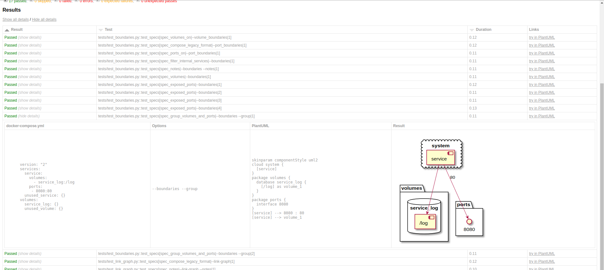

Test suite information
======================


Run the test suite
------------------

### With the pytest command

    pip install -r requirements.txt
    pytest -vv
    
Pros
- integrate well with IDE
- allows to debug, set breakpoints, etc
    
    
### With Docker Compose

    docker-compose run test

Pros
- the docker-compose.yml file will also set up a PlantUML server and resulting uml will generate images in a html report
  

Write new tests
---------------

- Unit tests can be writen as usual with pytest
- Integration test can be described with _spec yaml files_ and the help of the `spec` pytest fixture by obeing the following conventions:
  - provide a module level `__spec_files__` variable with the path to _spec yaml files_ as value
  - use the `spec` fixture in a test function and call `spec.run_assertions()`


### Spec yaml file format

The spec yaml files are yaml files composed of at least 2 documents:
- a _Docker Compose_ document
- one or more yml documents describing a scenario with the following keys:
  - `options` : a string describing the command line options to pass to compose_plantuml
  - `expected` : a string describing the expected uml result
  - `examples` : an optional list of dict used to describe placeholders and their replacement value

#### Simple spec yaml file

```yaml
version: "2"
services:
  service:
    ports:
      - 8080:80
---
options: --boundaries
expected: |
  skinparam componentStyle uml2
  cloud system {
    [service]
  }
  [service] --> 8080 : 80

```


#### Simple spec yaml file with multiple scenarios
```yaml
version: "3"
services:
  web:
    image: nginx
    ports:
    - 8080:80
    volumes:
    - /some/content:/usr/share/nginx/html
---
options: --boundaries
expected: |
  skinparam componentStyle uml2
  cloud system {
    [web]
  }
  [web] --> 8080 : 80
---
options: --volume_boundaries
expected: |
  skinparam componentStyle uml2
  cloud system {
    [web]
  }
  [web] --> 8080 : 80
```

#### Spec yaml file using example values

```yaml
version: "2"
services:
  service:
    volumes:
      - service_log:/log
    ports:
     - <port>:80
  unused_service: {}
volumes:
  service_log: {}
  unused_volume: {}
---
options: --boundaries
expected: |
      skinparam componentStyle uml2
      cloud system {
        [service]
      }
      database service_log {
        [/log] as volume_1
      }
      [service] --> <resulting port> : 80
      [service] --> volume_1
examples:
  - port: "8080"
    resulting port: "8080"
  - port: "8080/udp"
    resulting port: "8080udp"
---
options: --boundaries --group
expected: |
      skinparam componentStyle uml2
      cloud system {
        [service]
      }
      package volumes {
        database service_log {
          [/log] as volume_1
        }
      }
      package ports {
        interface <resulting port>
      }
      [service] --> <resulting port> : 80
      [service] --> volume_1
examples:
  - port: "8080"
    resulting port: "8080"
  - port: "8080/udp"
    resulting port: "8080udp"
```

Both the Docker Compose contents and the expected result text can have _placeholder_ 
which are replaced using the key:value found in the `examples` list.

In templates, placeholders must be wrapped with `<` and `>`.